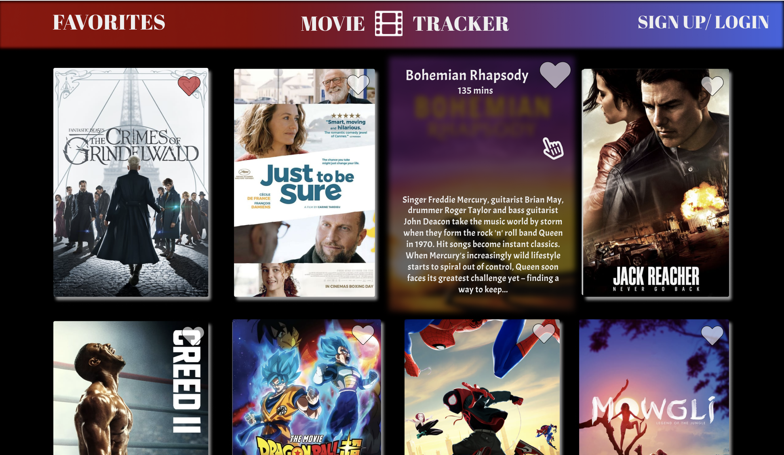
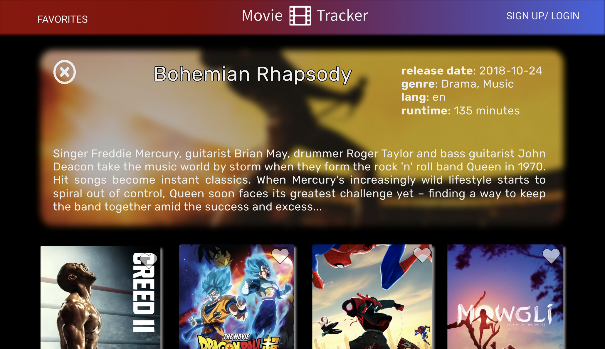
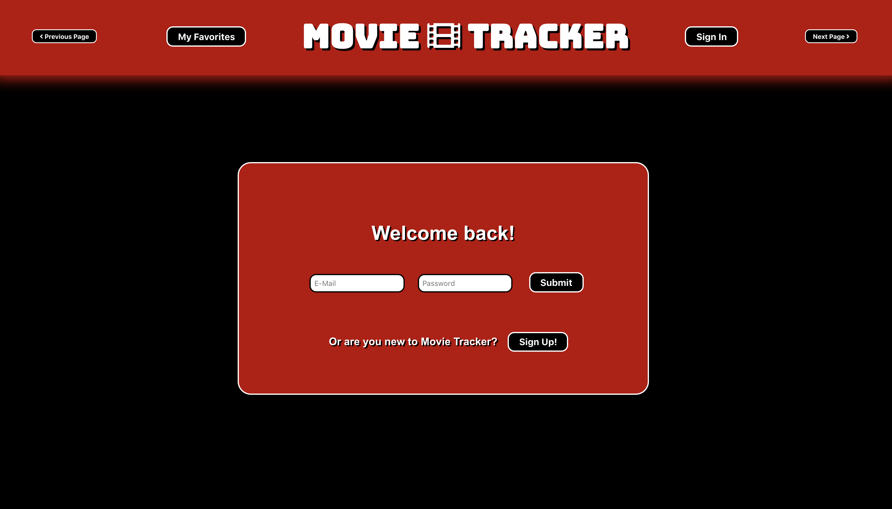

# Movie Tracker 

### Description of App:
In this application, we utilized The Movie DB API to create a personalized movie application to allow users to view, favorite, and search for movies within the database. The main goal of the project was to allow users to create accounts, favorite movies, and then be able to view those favorited movies when signing back in at a later time. This application contains a backend server to validate users as well as a client-side frontend created using create-react-app. 

### Tech used:
* React
* React-Redux
* Browser Router
* Thunks
* Jest

### Setup:
This project was bootstrapped with [Create React App](https://github.com/facebook/create-react-app).

#### Backend
To view this application, you first need to run the backend server by following these instructions:

* `git clone https://github.com/turingschool-examples/movie-tracker backend`
* `cd backend`
* `npm install`
* `npm start`

#### Frontend
Then, you can run the frontend server to view with the application

* `git clone https://github.com/colev1/movie-tracker`
* `cd movie-tracker/`
* `npm install`
* `npm start`

Open [http://localhost:3000](http://localhost:3000) to view it in the browser.

### Testing
In the movie-tracker directory, you can run the test files using:
`npm test`

### Design and Layout

##### Wireframe:

##### Our App:

